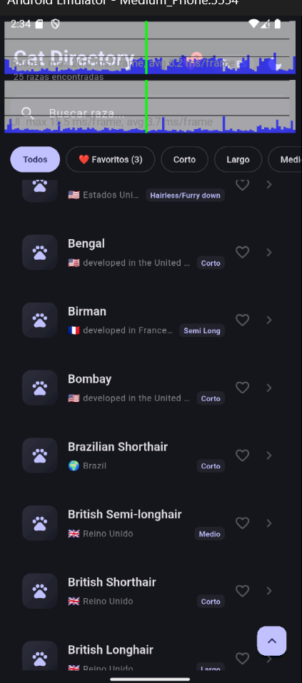
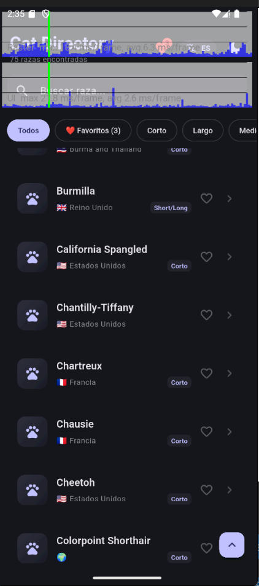
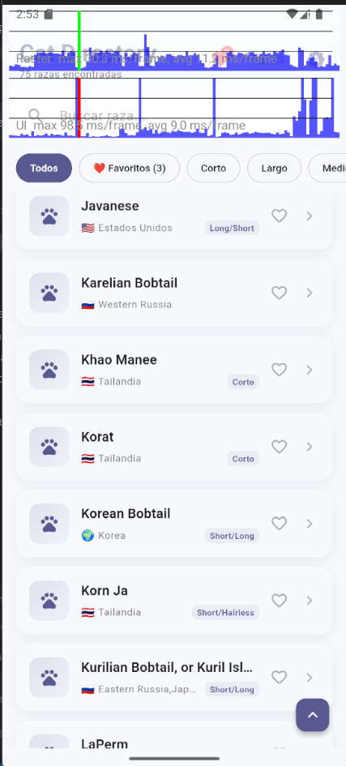

# 🐱 Cat Directory App

> **Prueba Técnica — Nextep Innovation** | Mobile Developer  
> **Stack:** Flutter 3.32.0
> **Calidad:** 38/38 Pruebas Unitarias Aprobadas (100%) • 0 incidencias en `flutter analyze`

---

## 📱 Descripción

Aplicación móvil que consume la API pública de [Catfact Ninja](https://catfact.ninja/) para consultar un catálogo interactivo de razas felinas, detalles taxonómicos y datos curiosos, diseñada con enfoque **Offline-First**, arquitectura limpia y alto rendimiento visual.

---

## 🏛 Arquitectura y Estructura

Se implementó **Clean Architecture** orientada a funcionalidades (**Feature-Driven**):

```
lib/
├── core/         # Inyección (AppInjector), Red (Dio), Router (GoRouter), Tema e Idioma
└── features/
    ├── breeds/    # data (models/datasources/repo) | domain (entities/usecases) | presentation (bloc/pages)
    ├── cat_fact/  # data (api/traducción) | domain | presentation (cubit/widget)
    └── favorites/ # data (hive) | domain | presentation (cubit/page)
```

- **Domain:** Lógica de negocio pura (entidades y casos de uso ejecutables) independiente de frameworks.
- **Data:** Implementación de repositorios, datasources remotos/locales y serialización fuertemente tipada (`freezed`).
- **Presentation:** Widgets desacoplados de la lógica de negocio mediante el patrón BLoC/Cubit.

---

## ⚡ Gestor de Estado: BLoC & Cubit

Se utilizó `flutter_bloc` combinando **BLoC** y **Cubit** según la necesidad del flujo:

- **`BreedsBloc` (Paginación y Búsqueda Concurrente):**
  - `droppable()` (`bloc_concurrency`): Descarta solicitudes de red simultáneas durante el scroll infinito rápido, evitando condiciones de carrera y datos duplicados.
  - `debounce(350ms)` (`stream_transform`): Espera a que el usuario termine de tipear en el buscador local antes de filtrar, manteniendo el hilo de UI a 60/120 FPS.
- **`Cubit` (Estados Atómicos y Directos):**
  - `ThemeCubit`, `LanguageCubit`, `CatFactCubit` y `FavoritesCubit`: Mutaciones sincrónicas y reactivas sin la sobrecarga de eventos innecesarios.

---

## 💾 Persistencia y Modo Offline (Stale-While-Revalidate)

- **Carga Inmediata:** Lee la primera página desde Hive (`breeds_cache`) y la muestra al instante (`isFromCache: true`).
- **Revalidación Asíncrona:** Consulta la API en segundo plano con TTL de 30 minutos y actualiza la lista sin bloquear la interfaz.
- **Ciclo de Vida:** Revalida automáticamente al regresar a primer plano tras permanecer más de 5 minutos en background (`WidgetsBindingObserver`).

---

## ✨ Funcionalidades Clave

- **Directorio (`/`):** Infinite scroll, pull-to-refresh, búsqueda local con debounce, botón flotante "volver arriba" y skeleton shimmer.
- **Filtros Rápidos & Banderas:** Chips por longitud de pelaje (*Corto, Largo, Medio, etc.*) y emojis de banderas según el país de origen.
- **Detalle (`/breed/:name`):** Ficha técnica completa, Hero animations y dato curioso con carga independiente y traducción al español.
- **Favoritos Offline (`/favorites`):** Persistencia en Hive, alternancia en tarjetas y detalle con `SnackBar`, y contador en la barra superior.
- **Deep Linking Nativo:** Android App Links (`assetlinks.json`) e iOS Universal Links (`apple-app-site-association`).
- **Modos y Temas:** Claro / Oscuro / Sistema y selector bilingüe (Español / Inglés).

---

## 📊 Auditoría de Rendimiento

### 1. Scroll Fluido sin Jank (60 / 120 FPS)

| Modo Oscuro (25 razas) | Modo Oscuro (75 razas) | Modo Claro (75 razas) |
| :---: | :---: | :---: |
|  |  |  |

- **Análisis de frames:** 
  Las métricas reales observadas en el `PerformanceOverlay` confirman un rendimiento sobresaliente en ambos temas (Claro y Oscuro) y a lo largo de la paginación continua:
  - **GPU / Raster thread:** promedio sostenido de **6.3 ms a 11.2 ms/frame** (muy por debajo del límite de 16.6 ms de 60 FPS).
  - **UI thread:** promedio sostenido de **2.6 ms a 9.0 ms/frame** (utilizando una fracción del presupuesto de fotograma).
  - **Explicación técnica de picos aislados:** Se observa un pico puntual en el UI thread durante la carga inicial en modo claro (~98 ms), atribuible al calentamiento JIT / compilación de shaders en el emulador Android y a la deserialización del bloque paginado; tras ello, el desplazamiento se estabiliza inmediatamente en promedios fluidos de **9.0 ms** en UI y **11.2 ms** en Raster sin jank perceptible.
  - **Factores de optimización aplicados:**
    - Reciclaje de ítems en ventana mediante `ListView.builder`.
    - Control de concurrencia `droppable()` en la paginación infinita (descarta peticiones de red duplicadas).
    - Temporizador `debounce(350ms)` en la búsqueda para evitar reconstrucciones por cada tecla pulsada.
    - Uso extensivo de constructores `const` y aislamiento de repintado en avatares y tarjetas.

### 2. Análisis de Tamaño del APK (`--analyze-size`)

Ejecutado con el comando:
```bash
flutter build apk --target-platform android-arm64 --analyze-size
```

| Componente | Tamaño Descomprimido | Descripción |
| :--- | :--- | :--- |
| **`lib/arm64-v8a`** | ~7.0 MB | Motor nativo C++ y runtime AOT de Flutter |
| **`package:flutter`** | 3.0 MB | Framework Flutter base |
| **`package:cat_directory_app`** | **90 KB** | Código fuente compilado de la aplicación |
| **`package:hive_ce`** | 104 KB | Persistencia local NoSQL binaria |
| **`package:go_router`** | 60 KB | Enrutamiento declarativo |
| **`package:dio`** | 57 KB | Cliente HTTP con retry exponencial |
| **`assets/flutter_assets`** | 106 KB | Fuentes e iconos optimizados |
| **`classes.dex`** | 217 KB | Bytecode Android compilado |

- **Detalles del binario y tamaño:**
  - **Ruta del APK generado:** [`build/app/outputs/flutter-apk/app-release.apk`](file:///build/app/outputs/flutter-apk/app-release.apk) (**7.4 MB**, listo para instalar o adjuntar en **GitHub Releases**).
  - **Visualización interactiva en Dart DevTools:**
    ```bash
    dart devtools --appSizeBase=~/.flutter-devtools/apk-code-size-analysis_01.json
    ```
  - El 95% del peso total corresponde al motor y runtime nativo inevitable de Flutter en arquitecturas ARM64 (`lib/arm64-v8a`).
  - El código de la aplicación es sumamente ligero (**90 KB**), lo cual demuestra ausencia de librerías infladas o código muerto.
  - El tree-shaking automático redujo las fuentes en más de un **99.6%** (`CupertinoIcons`: 1.1 KB, `MaterialIcons`: 4.9 KB).

---

## 🚀 Instalación y Ejecución

```bash
# 1. Instalar dependencias
flutter pub get

# 2. Ejecutar la app
flutter run

# 3. Correr la suite de pruebas unitarias (38 tests)
flutter test

# 4. Verificación de análisis estático
flutter analyze
```

### Prueba de Deep Link (Android ADB):
```bash
adb shell am start -a android.intent.action.VIEW \
  -c android.intent.category.BROWSABLE \
  -d "https://cat-directory.nextep.com/breed/Abyssinian"
```
